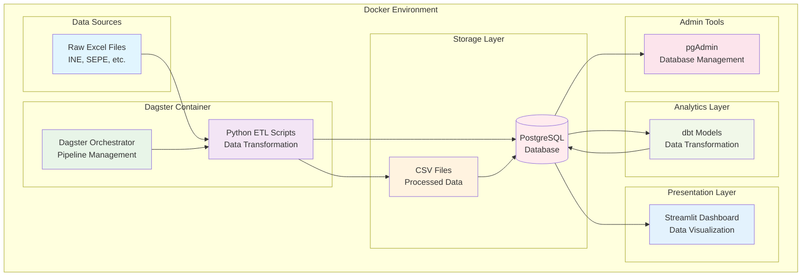

# Spanish Municipality Local Data Stack

This project tries to get all the possible data for each Spanish municipality or city from multiple sources of data (multiple ministeries, local entities, agencies...), parse and clean the data to then model it, and display the information on a dashboard.


## 🏗️ Architecture



### Project Structure
```
municipality-project/
├── dagster/                    # ETL pipeline code
│   
├── dbt/                       # Data transformation models
│   ├── models/
│   │   ├── staging/           # Raw data standardization
│   │   ├── intermediate/      # Business logic layer
│   │   └── marts/            # Analytics-ready tables
│   └── analyses/             # Report templates
│   └── macros/               # Reusable code across models
├── streamlit/                # BI dashboard application
│   ├── app.py               # Main dashboard
│   ├── utils/               # Database connectors
│   └── Dockerfile           # Container configuration
├── raw/                     # Source Excel files (gitignored)
├── clean/        # Processed CSV files (gitignored)  
├── docker-compose.yml        # Service orchestration
└── .env                      # Environment configuration (gitignored)
```


## 🚀 Quick Start

### Prerequisites

### Installation Steps
```bash
# Step 1

# Step 2

# Step 3
```

### Access Points
- **Service 1**: Description
- **Service 2**: Description


## 🔮 Future Plans

### Planned Features

### Enhancement Roadmap

## 📚 Documentation

- **[Documentation Link](./path)**: Description
- **[Documentation Link](./path)**: Description
- **[Documentation Link](./path)**: Description

